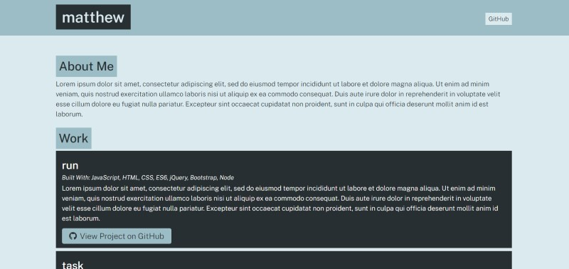

<h1 align="center">Portfolio Generator</h1>

<p align="center">
    
    
    
</p>
<h2 align="center">Example of finished product</h2>
<p align="center">
    
</p>


## Table of Contents
- [Description](#description)
- [Installation](#install)
- [Usage](#usage)
- [Repo](#Repo)
- [Questions](#questions)

## Description
A node.js application that uses Inquirer to create a portfolio for the user.

## Install
```
`npm install`
```
## Usage
In the terminal run
```
node app.js
```
after you will be prompted to answer questions about your work and self.


## Repo
Below is a link to the GitHub repository   
[Team Profile Generator](https://github.com/mattkohl82/team-profile-generator)   

## Questions
### [Mattkohl82 for GitHub](https://github.com/Mattkohl82)  
### mattkohl82@gmail.com for ✉️ email 

